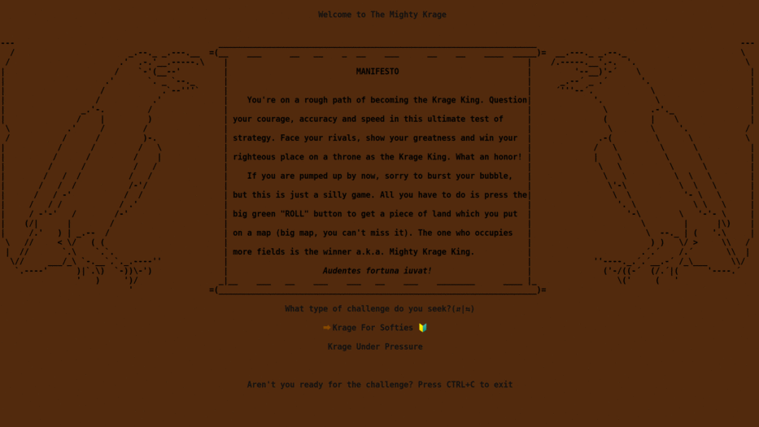

# Krage

Krage is a terminal-based game for 2-4 players. Each player puts a piece of land on the map next to his conquered field. The dominant player is the winner, who becomes The Mighty Krage King!



## Installation

The game works on GNOME Terminal v3.0 or later and Ruby > 2.4 (tested on Ubuntu and Fedora)\
```
git clone https://github.com/Slate5/krage.git
cd krage && rake
```

## Play

Start the game from desktop or run the command from a terminal:
<br/><br/>`krage [-s]`<br/><br/>
For silent game use flag "-s".\
The first start takes up to a few seconds to adjust the screen and other settings.

## Uninstallation

From Krage directory: `rake uninstall && cd`

## Features

- [x] 🔰 - Game style: start game from a corner
- [x] ⚔️ - Game style: start game from the middle
- [x] 📖 - Fields: how many more fields player has to own at the end of this round to be a winner
- [x] 📖 - Jokers: how many fields you have to conquer to gain bonus joker
- [x] ⏳ - earn this by being fast and get extra joker (5 needed)
- [x] 🎯 - try to place land on the map without mistake to gain these (5 needed for a joker)
- [x] 🎶 - Note: this button pauses the music contrary to key <kbd>m</kbd> which stops it
- [ ] 📶 - play over the internet

## Keyboard instruction

| Keyboard | Console |
| -------- | ------- |
|<kbd>r</kbd>| ROLL|
|<kbd>s</kbd>| SKIP|
|<kbd>g</kbd>| GIVEUP|
|<kbd>q</kbd>| ROTATE|
|<kbd>x</kbd>| REROLL ⥢ ⥤|
|<kbd>y</kbd>| REROLL ⥣ ⥥|
|<kbd>w</kbd>| REROLL ⥥ ⥤|
|<kbd>e</kbd>| EAT|
|<kbd>m</kbd>| Stop/Play Sounds|
|<kbd>1</kbd>| Fill Direction 1|
|<kbd>2</kbd>| Fill Direction 2|
|<kbd>3</kbd>| Fill Direction 3|
|<kbd>4</kbd>| Fill Direction 4|
